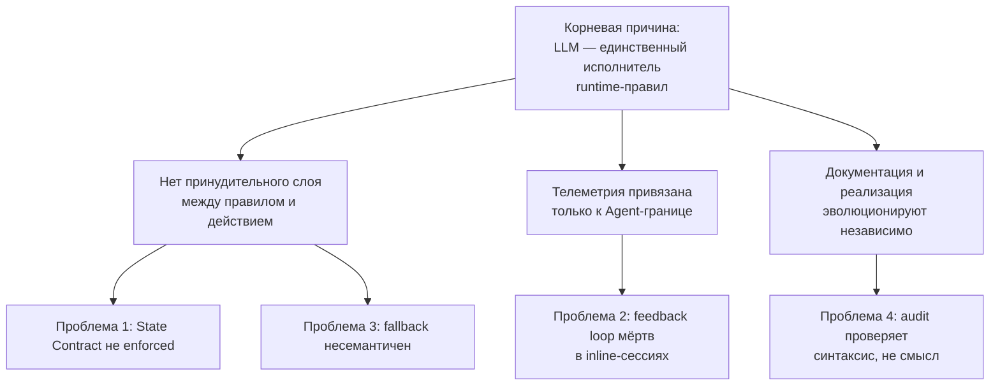
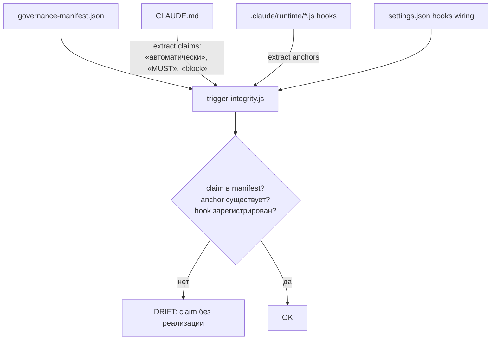
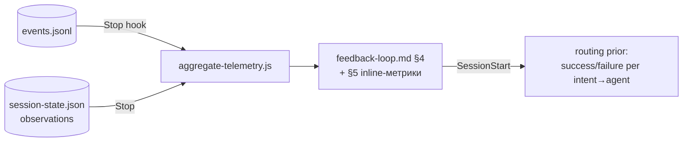
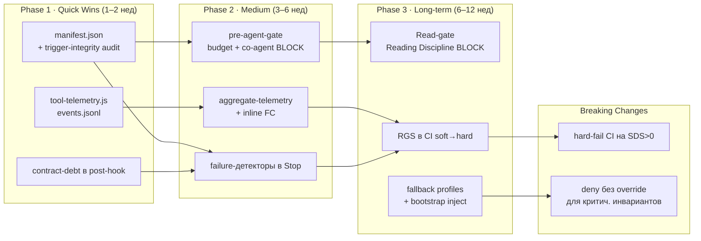
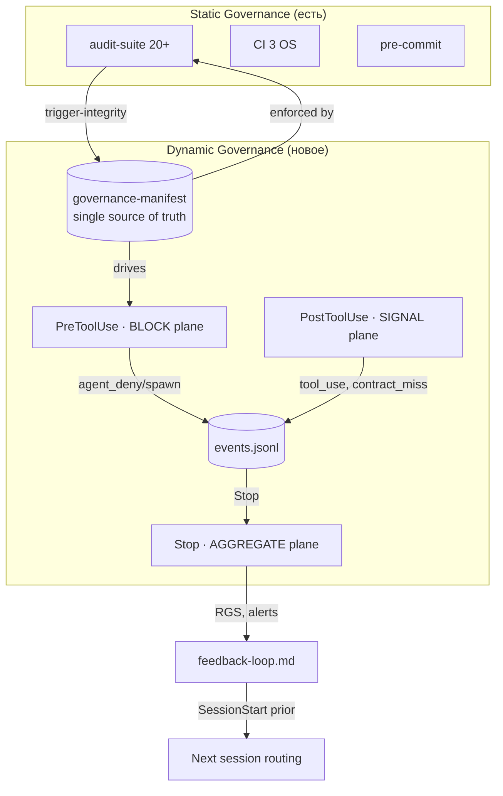

# RFC: Machine-Enforced Runtime Governance

**Status:** Draft for review
**Author:** Principal Architect (runtime governance)
**Date:** 2026-06-07
**Closes design gap:** F-RT-05 (`docs/tasks/runtime-enforcement-design-gap.md`)
**Builds on:** ADR-016 (token attribution boundary), ADR-017 (State Update observability)
**First implementation PR:** R1+R2 — см. `docs/plans/2026-06-07-runtime-governance-foundation.md`

---

## 1. Executive Summary

Система обладает **сильной статической governance** (audit-suite 19/19, CI на 3 ОС, pre-commit, schema/ADR/ref-проверки), но **почти нулевой динамической**. Всё runtime-поведение — маршрутизация, Planner, Risk Rules, лимит агентов, co-agent triggers, State Contract, feedback loop, fallback — существует как **проза в `CLAUDE.md`, исполняемая LLM добровольно**. Это `prescriptive`, а не `enforced` система.

ADR-017 сделал первый шаг: пропуск `## State Update` стал *наблюдаемым* (`missing_state_update`). Но наблюдаемость без принуждения — это термометр без лечения.

**Тезис RFC:** перевести систему в `Machine-Enforced Runtime Governance` можно **без переписывания архитектуры**, опираясь на уже существующий, но недоиспользованный субстрат — **hooks Claude Code**. Ключевое наблюдение:

> `PreToolUse` hook может **заблокировать** вызов инструмента (deny). Это единственный в системе примитив, превращающий «должно быть» в «иначе не выполнится». Сейчас он не используется для governance вообще.

Стратегия в три слоя:
1. **Enforcement plane** — `PreToolUse` блокирует нарушения инвариантов *до* их совершения (лимит агентов, co-agent на HIGH-risk, Reading Discipline).
2. **Telemetry plane** — `PostToolUse` на *всех* инструментах (не только `Agent`) даёт телеметрию inline-сессий, которой сегодня нет. Закрывает «feedback loop не обучается».
3. **Semantic governance plane** — реестр инвариантов (`governance-manifest.json`) как single source of truth + audit, доказывающий, что каждое «автоматически активируется» имеет реальную реализацию. Закрывает semantic drift.

**Ожидаемый эффект:** Enforcement Coverage с ~5% (только allowlist) до 60–70% за 3 фазы; Contract Compliance Rate измерим и растёт; semantic drift детектируется в CI.

---

## 2. Root Cause Analysis



Четыре заявленные проблемы — **не независимы**, у них общий корень: **отсутствие исполнительного слоя (enforcement plane)**. LLM читает `CLAUDE.md` и *решает* следовать. Любое правило, которое модель «забыла», «срезала» или нарушила под давлением контекста, проходит молча, потому что **некому проверить инвариант в момент действия**.

| Проблема | Непосредственная причина | Корневая причина |
|---|---|---|
| 1. State Contract не enforced | `post-agent-hook` ставит fallback вместо сигнала (частично решено ADR-017) | пост-фактумная природа `PostToolUse` — выход уже произведён |
| 2. Feedback loop мёртв | observations пишутся только на `Agent`-границе | телеметрия не покрывает inline-инструменты (Read/Edit/Bash) |
| 3. Fallback несемантичен | `general-purpose` стартует без доменного контекста | нет механизма инъекции инвариантов в промпт fallback-агента |
| 4. Audit без смысла | чеки парсят структуру, не семантику | нет машиночитаемого реестра инвариантов, с которым сверять прозу |

**Вывод:** локальные правки каждой проблемы дадут 4 несвязных патча. Системное решение — **построить три недостающих plane** (enforcement / telemetry / semantic), и тогда все четыре проблемы становятся частными случаями.

---

## 3. Architectural Weaknesses

| # | Слабость | Где видно в коде | Класс |
|---|---|---|---|
| W1 | `PreToolUse` не используется для governance — есть только статический allowlist | `.claude/settings.local.json` permissions | Enforcement gap |
| W2 | Телеметрия только на `Agent` | `post-agent-hook.js:150` `if (tool_name !== 'Agent') return` | Observability gap |
| W3 | Контракт нарушаем пост-фактум, без эскалации | `post-agent-hook.js:178` fallback summary | Contract gap |
| W4 | Нет реестра инвариантов; `CLAUDE.md` — единственный источник, человекочитаемый | — | Drift surface |
| W5 | Триггеры заявлены, но «не машинный enforcement» (признано в самом CLAUDE.md) | CLAUDE.md §«Auxiliary Agents» «Хук НЕ авто-спавнит» | Honest-but-unenforced |
| W6 | fallback `general-purpose` без bootstrap | execute-dag `buildPrompt` грузит только `loadAgent(step.agent)` | Semantic fallback gap |
| W7 | Два писателя observations с дивергентной логикой | `post-agent-hook` vs `execute-dag.applyStepResult` | Consistency risk |
| W8 | Главный исполнитель (inline main-agent) невидим для токен-атрибуции | ADR-016 quarantine T-03/04/05 | Measurement gap |

W8 — фундаментальное ограничение платформы (нет API для raw-token-атрибуции main-agent). RFC **не пытается его обойти** — вместо токенов мы меряем **события** (которые наблюдаемы через hooks на каждом инструменте). Это смещение «токены → события» — ключ к телеметрии inline-сессий.

---

## 4. Runtime Enforcement Strategy

### 4.1 Примитивы субстрата

| Hook | Сила | Может | Latency-бюджет |
|---|---|---|---|
| `PreToolUse` | **Блок** | deny/ask/inject *до* вызова | <50 мс (hot-path) |
| `PostToolUse` | Сигнал | flag/log *после* | <50 мс |
| `UserPromptSubmit` | Инъекция | добавить контекст в turn | <100 мс |
| `Stop` | Агрегация | rollup на завершении | <500 мс |
| `SessionStart` | Bootstrap | загрузить governance-контекст | один раз |
| permissions allowlist | Статика | разрешить/запретить по паттерну | 0 |

**Принцип:** каждый инвариант маппится на *слабейший достаточный* примитив. Блокировать (`PreToolUse`) — только то, что действительно нельзя нарушать; остальное — сигналить.

### 4.2 Маппинг инвариантов

| Инвариант (CLAUDE.md) | Сегодня | Предлагается | Примитив |
|---|---|---|---|
| `max 2–3 agents total` | проза | счётчик активных шагов; 4-й `Agent` → **deny** | PreToolUse |
| `HIGH → security-reviewer co-agent` | проза | `risk:HIGH` + нет co-agent в `dag` → **deny**/жёсткий warn | PreToolUse |
| Reading Discipline (`no full file reads`) | проза | `Read` без `offset/limit` по файлу из §16 → **deny** | PreToolUse |
| State Update present | flag (ADR-017) | flag + `contract_debt`; порог → эскалация | PostToolUse |
| Planner для `intents≥3` | проза | advisory-инъекция при детекте | UserPromptSubmit |
| Fallback при DEGRADED | проза | bootstrap-инъекция (fallback profiles) | execute-dag/buildPrompt |

### 4.3 Псевдокод Agent-gate

```js
// .claude/runtime/pre-agent-gate.js — registered as PreToolUse[Agent]
const MAX_AGENTS = 3;

function gate(payload) {
  if (payload.tool_name !== 'Agent') return allow();
  const state = readState();
  const target = resolveAgent(payload.tool_input);   // reuse post-agent-hook resolver

  // INVARIANT 1 — agent budget
  const spawned = (state.observations || []).length + countInFlight(state);
  if (spawned >= MAX_AGENTS && !payload.tool_input?.override) {
    return deny(`[gate] agent budget ${MAX_AGENTS} exceeded (${spawned} used). `
      + `CLAUDE.md §Execution. Override: set tool_input.override.`);
  }

  // INVARIANT 2 — HIGH risk requires security co-agent
  if (state.risk === 'HIGH' && touchesSecuritySurface(state, target)
      && !hasCoAgent(state, 'security-reviewer')) {
    return deny(`[gate] HIGH-risk security surface requires security-reviewer `
      + `co-agent (CLAUDE.md Risk Rules). Add it to the dag before spawning ${target}.`);
  }
  return allow();
}
```

**Почему `deny`, а не warn:** warn — тот же добровольный режим. `deny` физически останавливает вызов и возвращает LLM ошибку, заставляя пересмотреть план. Это и есть «невозможно нарушить незаметно».

**Escape hatch обязателен:** каждый `deny` имеет документированный, логируемый override. Принцип: **жёстко по умолчанию, но с явным аудируемым обходом.**

---

## 5. Contract Enforcement Strategy

### 5.1 Спектр принуждения

```
Level 0  observe   — флаг missing_state_update            ✅ ADR-017 (есть)
Level 1  escalate  — contract_debt++; порог → Stop-алерт   ← предлагается
Level 2  correct   — авто-реинъекция требования в next prompt
Level 3  block     — только для pre-action инвариантов (агент-гейт)
```

`## State Update` нельзя блокировать *до* вывода (выход агента уже сгенерирован) → для него эскалация, не блок.

### 5.2 Contract-debt

```js
// дополнение к post-agent-hook.js (PostToolUse[Agent])
if (missingBlock) {
  state.contract_debt = (state.contract_debt || 0) + 1;
  if (state.contract_debt >= CONTRACT_DEBT_THRESHOLD) {  // напр. 3
    (state.governance_alerts ||= []).push({
      kind: 'state_contract_degraded', at: new Date().toISOString(),
      debt: state.contract_debt,
    });
  }
}
```

- **Level 2 (correct)** в `execute-dag`: если предыдущий шаг `missing`, `buildPrompt` следующего добавляет усиленную преамбулу. В live-сессии аналог — `UserPromptSubmit` инъекция при ненулевом `contract_debt`.
- `outcome` **не трогаем** (ADR-017 инвариант): contract-debt ортогонален task-результату.

### 5.3 Семантический fallback (Проблема 3)

```jsonc
// .claude/runtime/fallback-profiles.json
{
  "ccip-backend-core": {
    "domain_anchors": ["docs/architecture/period-engine.md#state-machine"],
    "invariants": ["PeriodEngine = state machine; не мутировать period после lock",
                   "BullMQ workers идемпотентны; Transactional Outbox обязателен"],
    "forbidden": ["прямой UPDATE на immutable period"]
  }
}
```

При fallback `buildPrompt` инжектит профиль исходного (DEGRADED) агента в промпт `general-purpose` — **lightweight knowledge injection**: не полное знание, но критические инварианты. Профили валидируются audit'ом (anchors существуют).

---

## 6. Semantic Governance Architecture

### 6.1 Governance Manifest — single source of truth

```jsonc
// .claude/runtime/governance-manifest.json
{
  "invariants": [
    { "id": "INV-AGENT-BUDGET", "claim": "max 2–3 agents total",
      "doc_anchor": "CLAUDE.md#Execution",
      "enforcement": "hook:pre-agent-gate.js#INVARIANT_1",
      "kind": "block", "telemetry": "events.jsonl:agent_spawn",
      "status": "enforced" },
    { "id": "INV-STATE-CONTRACT", "claim": "agent MUST end with ## State Update",
      "doc_anchor": "CLAUDE.md#§15",
      "enforcement": "hook:post-agent-hook.js#missingBlock",
      "kind": "signal", "status": "observed" },
    { "id": "INV-SECURITY-COAGENT", "claim": "HIGH risk → security-reviewer co-agent",
      "doc_anchor": "CLAUDE.md#Risk-Rules",
      "enforcement": "hook:pre-agent-gate.js#INVARIANT_2",
      "kind": "block", "status": "enforced" }
  ]
}
```

### 6.2 Новый audit: `trigger-integrity.js`



Алгоритм:
1. Извлечь из `CLAUDE.md` все «активирующие» утверждения (regex: *автоматически, MUST, обязан, иначе, block, trigger*).
2. Каждое — запись в manifest (иначе `unregistered-claim`).
3. Для `kind != advisory` — `enforcement`-anchor существует в коде (reuse `adr-anchors.js`/`section-anchors.js`).
4. Для `kind: block|signal` — hook зарегистрирован в `settings.json` (парс wiring).
5. Обратно: каждая enforcement-логика в hooks имеет manifest-запись (иначе `undocumented-enforcement`).

Это **semantic audit**: ловит «Trigger X задокументирован, реализации нет» и «код принуждает к тому, чего нет в доке».

### 6.3 Встраивание

Добавляется как `§10.x Semantic integrity` в `audit-suite.js` (19 → 20+). Переиспользует anchor-window инфраструктуру (та же, что `verify-evidence-log.js`, ±200 симв.). Запускается в pre-commit и CI — drift ловится **до мёржа**.

---

## 7. Telemetry Architecture (Проблема 2)

### 7.1 Сдвиг: токены → события

ADR-016: raw-токены main-agent **невидимы** для hooks. Но **события инструментов видимы** — `PostToolUse` срабатывает на *каждый* Read/Edit/Bash/Grep/Glob/Write. Не «сколько токенов», но «что произошло». Для feedback loop достаточно.

### 7.2 Event-log

```js
// .claude/runtime/tool-telemetry.js — PostToolUse[*] (все инструменты)
const ev = {
  ts: new Date().toISOString(), session: state.session_id,
  tool: payload.tool_name, target: extractTarget(payload),
  bytes: estimateBytes(payload),       // прокси объёма, не токены
  full_read: isFullRead(payload),      // для Reading Discipline
  outcome: payload.tool_response?.is_error ? 'error' : 'ok',
};
appendJSONL('.claude/runtime/events.jsonl', ev);   // append-only, ротация по размеру
```

### 7.3 События

| Событие | Источник | Используется для |
|---|---|---|
| `agent_spawn` / `agent_deny` | pre-agent-gate | Enforcement Coverage, budget |
| `tool_use` (Read/Edit/Bash/…) | tool-telemetry | **Feedback Coverage inline-сессий** |
| `full_read_blocked` | Read-gate | Reading Discipline compliance |
| `state_contract_miss` | post-agent-hook | Contract Compliance Rate |
| `contract_debt_threshold` | post-agent-hook | Failure detection |
| `governance_alert` | любой detector | алертинг |

### 7.4 Агрегация и обучение маршрутизации



- На `Stop`: `aggregate-telemetry.js` сворачивает `events.jsonl` + `observations` в per-session метрики.
- **Inline-сессии дают сигнал**: даже без субагентов есть `tool_use` → Feedback Coverage > 0.
- Обучение routing: счётчики `success/failure` per `intent→agent` + `tool-mix`-профиль → prior, который `SessionStart` инжектит в следующую сессию.

**Граница (честно):** телеметрия *событий и покрытия*, не *стоимости*. Token-cost остаётся в карантине (ADR-016). Сознательное ограничение.

---

## 8. Failure Detection Model

Детекторы — чистые функции над `state` + `events.jsonl`, на `Stop` и в nightly CI.

| Детектор | Сигнал | Формула триггера |
|---|---|---|
| Silent State Degradation | контракт тихо деградирует | `SSC < 0.8` |
| Telemetry Blackout | сессия работала, но без следов | `tool_calls > 0 ∧ events == 0` |
| Handoff Decay | качество handoff падает | `empty_handoff / total_handoff > 0.4` |
| Semantic Drift | доки разошлись с кодом | `trigger-integrity != OK` |
| Fallback Degradation | fallback без bootstrap | `general-purpose spawn ∧ no profile inject` |
| Contract Collapse | контракт массово игнорируется | `contract_debt ≥ 3` за сессию |

Каждый детектор пишет в `governance_alerts[]` и (в CI) — в annotation PR. «Незаметная деградация» → видимый сигнал.

---

## 9. Reliability Metrics

Все вычислимы из `session-state.json` + `events.jsonl` + `governance-manifest.json` — без новых источников.

| KPI | Формула | Источник | Цель |
|---|---|---|---|
| **Contract Compliance Rate (CCR)** | `1 − (Σ missing_state_update / Σ observations)` | observations | ≥ 0.95 |
| **Structured State Coverage (SSC)** | `valid_blocks / agent_invocations` | observations | ≥ 0.90 |
| **Routing Confidence (RC)** | `Σ(success)·w / Σ(all outcomes)` per intent→agent | observations | ≥ 0.85 |
| **Trigger Integrity (TI)** | `enforced_or_advisory_claims / total_claims` | manifest+audit | = 1.0 |
| **Feedback Coverage (FC)** | `sessions_with_events / total_sessions` | events.jsonl | ≥ 0.80 |
| **Semantic Drift Score (SDS)** | `unregistered_claims + undocumented_enforcement` | trigger-integrity | = 0 |
| **Runtime Governance Score (RGS)** | `0.3·EC + 0.25·CCR + 0.2·FC + 0.15·TI + 0.1·RC` | все | ≥ 0.75 |
| **Enforcement Coverage (EC)** | `invariants(kind∈{block,signal}) / total_invariants` | manifest | ≥ 0.60 |
| **Fallback Confidence (FBC)** | `fallback_spawns_with_profile / total_fallback_spawns` | events+profiles | ≥ 0.90 |
| **Agent Context Quality (ACQ)** | `1 − (injection_stripped + truncated_handoff) / handoffs` | sanitize log | ≥ 0.85 |

**RGS** — северная звезда: единое число «насколько runtime принуждён». Считается на `Stop`, тренд в `feedback-loop.md`, регрессия в CI — soft-fail → hard-fail после стабилизации baseline.

---

## 10. Migration Plan



**Критический путь:**
- `manifest` (Q1) — фундамент и для semantic audit, и для EC/TI. Делается **первым**.
- `tool-telemetry` (Q2) — независим, параллельно; разблокирует telemetry-ветку.
- `pre-agent-gate` (M1) требует manifest (Q1).
- RGS hard-fail (B1) — только после стабильного baseline (≥ N сессий из M2/L3).

**Принцип:** каждый enforcement сначала в **shadow-режиме** (логирует, что *заблокировал бы*, но пропускает) → метрика FPR → при FPR < порога переключается в `deny`. Никакого big bang.

---

## 11. Risk Analysis

| Риск | Severity | Митигизация |
|---|---|---|
| False-positive deny ломает работу | HIGH | shadow → FPR-метрика → переключение по порогу; аудируемый override |
| Latency hooks в hot-path | MED | бюджет <50 мс; sync, без сети/тяжёлого I/O; benchmark в CI |
| events.jsonl распухает | MED | append-only + ротация; агрегация на Stop с очисткой raw |
| Manifest расходится с CLAUDE.md (новый drift surface) | MED | trigger-integrity двунаправлен |
| Over-enforcement душит гибкость LLM | MED | блок только критич. инвариантов; остальное signal/advisory |
| Hook-сбой роняет сессию | HIGH | **fail-open** + лог (паттерн уже в `post-agent-hook` exit 0) |
| Платформенное ограничение токен-атрибуции | LOW | принято явно (ADR-016); метрики на событиях |

**Ключевой принцип:** governance-слой при собственной ошибке **fail-open** (пропускает + громко логирует), не fail-closed. Принуждение не должно стать новым классом отказов.

---

## 12. Prioritized Recommendations

| # | Предложение | Impact | Complexity | Risk | ROI | Фаза |
|---|---|---|---|---|---|---|
| R1 | governance-manifest + trigger-integrity audit | H | M | L | ★★★★★ | 1 |
| R2 | tool-telemetry (events.jsonl, все инструменты) | H | L | L | ★★★★★ | 1 |
| R3 | contract-debt эскалация | M | L | L | ★★★★ | 1 |
| R4 | pre-agent-gate (budget + co-agent BLOCK) | H | M | M | ★★★★ | 2 |
| R5 | aggregate-telemetry + inline FC | H | M | L | ★★★★ | 2 |
| R6 | failure-детекторы в Stop | M | M | L | ★★★ | 2 |
| R7 | Read-gate (Reading Discipline) | M | M | M | ★★★ | 3 |
| R8 | fallback capability profiles | M | H | M | ★★★ | 3 |
| R9 | RGS в CI (soft→hard) | M | M | H | ★★ | 3→BC |

**Старт:** R1 + R2 — оба дёшевы, низкий риск, высокий impact, **разблокируют всё остальное**. Это первый PR (см. план реализации).

---

## 13. Expected Architecture After Refactoring



**Было → стало:**

| Свойство | Documentation-driven | Machine-Enforced |
|---|---|---|
| Критические инварианты | проза, добровольно | `PreToolUse deny` + override-аудит |
| State Contract | flag (ADR-017) | flag + debt + эскалация |
| Телеметрия | только Agent-граница | все инструменты, inline покрыты |
| Feedback loop | мёртв без субагентов | обучается на событиях |
| Fallback | технический | семантический (bootstrap profiles) |
| Audit | синтаксис | синтаксис + семантика |
| Источник истины правил | CLAUDE.md (человеку) | manifest (машине) ⟷ CLAUDE.md (сверяется audit'ом) |
| Наблюдаемость нарушений | RGS неизвестен | RGS измерим, тренд в CI |
| Enforcement Coverage | ~5% (allowlist) | 60–70% |

**Конечное состояние:** `CLAUDE.md` остаётся источником для человека, но каждое его «автоматически/MUST» имеет машинного двойника в manifest, принуждается hook'ом и доказывается audit'ом. Нарушить инвариант *незаметно* становится невозможно: либо `deny` остановит, либо событие зафиксирует, либо детектор поднимет алерт, либо CI поймает drift.

---

## Замечания по реализации

- **Совместимость:** всё аддитивно. manifest, events.jsonl, новые hooks — новые файлы. Существующие 19 audit-чеков и schema не ломаются. Enforcement катится через shadow-режим. Breaking changes — только Phase BC, по явному решению.
- **Самый дешёвый первый шаг:** R1+R2 — один PR (`docs/plans/2026-06-07-runtime-governance-foundation.md`).
- **Граница RFC:** token-cost-атрибуция main-agent (ADR-016) — вне scope; метрики на событиях.

---

## Связанные документы

- Gap-задача: `docs/tasks/runtime-enforcement-design-gap.md` (F-RT-05)
- План реализации R1+R2: `docs/plans/2026-06-07-runtime-governance-foundation.md`
- ADR-016 — `docs/decisions/ADR-016-token-efficiency-auditor.md` (граница токен-атрибуции)
- ADR-017 — `docs/decisions/ADR-017-state-update-observability.md` (Level 0 observe)
- State Contract — `CLAUDE.md §15`
